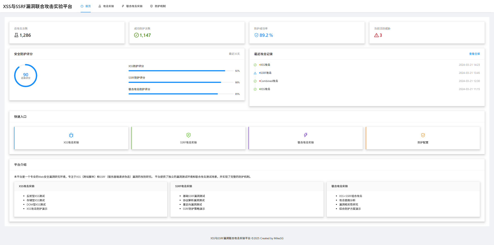
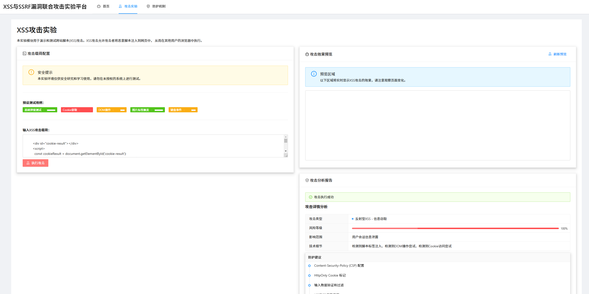
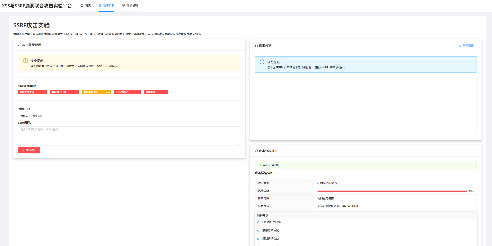
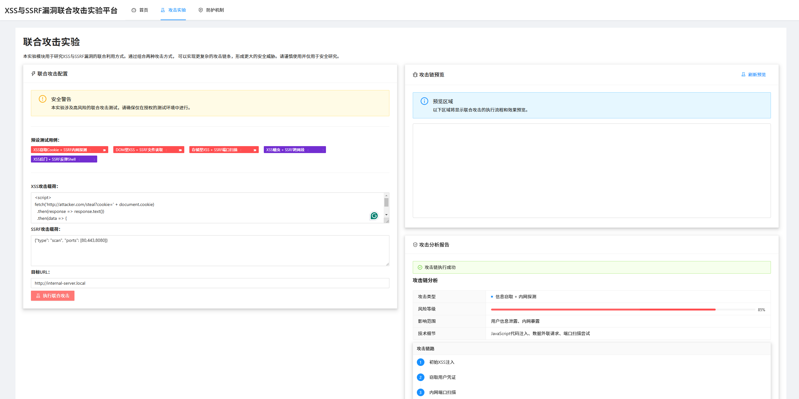

# XSS与SSRF漏洞联合攻击实验平台 🛡️

[](https://www.typescriptlang.org/)
[](https://reactjs.org/)
[](https://ant.design/)
[](https://nodejs.org/)

## 项目简介 📝

本项目是一个用于研究XSS漏洞与SSRF漏洞联合攻击及其综合防范机制的实验平台。平台提供了独立的XSS攻击、SSRF攻击测试环境，以及两种漏洞的联合攻击测试环境，同时实现了相应的防护机制。

### 主要特性 ✨

- 🔍 **独立的XSS攻击测试模块**
  - 支持反射型XSS测试
  - 支持存储型XSS测试
  - 支持DOM型XSS测试
  - 实时攻击效果展示

- 🌐 **独立的SSRF攻击测试模块**
  - 支持基础SSRF漏洞测试
  - 支持协议解析漏洞测试
  - 支持重定向漏洞测试
  - 详细的请求响应分析

- 🔗 **联合攻击测试模块**
  - XSS与SSRF组合攻击场景
  - 攻击链路可视化
  - 攻击影响分析
  - 实时防护效果展示

- 🛡️ **综合防护机制**
  - XSS防护策略实现
  - SSRF防护策略实现
  - 联合攻击防护方案
  - 防护效果实时监控

## 技术架构 🏗️

### 前端技术栈
- React 18
- TypeScript
- Ant Design 5
- React Router 6

### 后端技术栈
- Node.js
- Express
- TypeScript
- MongoDB

## 快速开始 🚀

### 环境要求
- Node.js 16.x 或更高版本
- npm 8.x 或更高版本
- MongoDB 4.x 或更高版本

### 安装步骤

1. 克隆项目
```bash
git clone https://github.com/MilesSG/XSS_SSRF_Attack_Prevention.git
cd XSS_SSRF_Attack_Prevention
```

2. 安装依赖
```bash
# 安装后端依赖
cd backend
npm install

# 安装前端依赖
cd ../frontend
npm install
```

3. 配置环境变量
```bash
# 后端配置
cd backend
cp .env.example .env
# 编辑.env文件，配置必要的环境变量
```

4. 启动服务
```bash
# 启动后端服务
cd backend
npm start

# 启动前端服务
cd frontend
npm start
```

5. 访问应用
打开浏览器访问 http://localhost:3000

## 功能展示 📸

### 主页面


### XSS攻击测试


### SSRF攻击测试


### 联合攻击测试


## 安全说明 ⚠️

本项目仅用于安全研究和学习目的，请勿在未授权的系统上进行测试。在使用本平台时，请确保：

1. 仅在受控的实验环境中进行测试
2. 不要对未授权的系统发起攻击
3. 遵守相关法律法规和道德准则

## 贡献指南 🤝

欢迎提交问题和改进建议！提交代码时请遵循以下步骤：

1. Fork 本仓库
2. 创建您的特性分支 (`git checkout -b feature/AmazingFeature`)
3. 提交您的改动 (`git commit -m 'Add some AmazingFeature'`)
4. 推送到分支 (`git push origin feature/AmazingFeature`)
5. 打开一个 Pull Request

## 开源协议 📄

本项目采用 MIT 协议 - 查看 [LICENSE](LICENSE) 文件了解详细信息

## 联系方式 📮

- 项目维护者：MilesSG
- GitHub：[@MilesSG](https://github.com/MilesSG)

## 致谢 🙏

感谢所有为本项目提供支持和帮助的人！ 